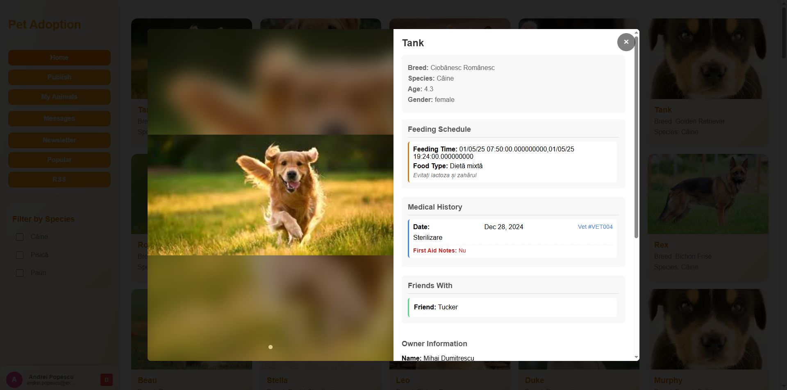

<div align="center">

  <h1>Platformă de Adopție Animale de Companie</h1>

  <p>
    O aplicație web care conectează familiile cu animale de companie disponibile pentru adopție.
  </p>

  <!-- Badges -->
  <p>
    
    
    
  </p>

</div>

<br/>

# :notebook_with_decorative_cover: Cuprins

- [Despre Proiect](#star2-despre-proiect)
  - [Capturi de Ecran](#camera-capturi-de-ecran)
  - [Demo Video](#movie_camera-demo-video)
  - [Tehnologii Utilizate](#space_invader-tehnologii-utilizate)
  - [Funcționalități](#dart-funcționalități)
  - [Referință Culori](#art-referință-culori)
  - [Variabile de Mediu](#key-variabile-de-mediu)
- [Primii Pași](#toolbox-primii-pași)
  - [Cerințe Preliminare](#bangbang-cerințe-preliminare)
  - [Instalare](#gear-instalare)
  - [Rulare Locală](#running-rulare-locală)
  - [Implementare](#triangular_flag_on_post-implementare)
- [Utilizare](#eyes-utilizare)
- [Plan de Dezvoltare](#compass-plan-de-dezvoltare)
- [Întrebări Frecvente](#grey_question-întrebări-frecvente)
- [Licență](#warning-licență)
- [Contact](#handshake-contact)
- [Mulțumiri](#gem-mulțumiri)

---

## :star2: Despre Proiect

Platforma de Adopție a Animalelor de Companie este o aplicație web care permite utilizatorilor autentificați să publice anunțuri pentru animale disponibile pentru adopție sau să adopte animale de companie. Sistemul oferă funcționalități complete pentru gestionarea resurselor privitoare la îngrijirea animalelor, precum și facilitarea procesului de adopție.

### :camera: Capturi de Ecran

<div align="center"> 
  
  <p>Autentificare utilizator</p>

  
  <p>Înregistrare cont nou</p>

  
  <p>Pagina principală cu animale disponibile pentru adopție</p>
  
  
  <p>Formular pentru publicarea unui animal spre adopție</p>
  
  
  <p>Mesagerie între utilizatori pentru detalii despre adopție</p>
  
  
  <p>Secțiune cu cele mai populare animale</p>
  
  
  <p>Gestionarea animalelor publicate de utilizator</p>

  
  <p>Flux RSS cu ultimele anunțuri</p>

  
  <p>Vizualizarea detaliată a unui animal</p>

  
  <p>Autentificare administrator</p>

  
  <p>Panou de administrare: statistici utilizatori și animale</p>

  
  <p>Listă utilizatori existenți</p>

  
  <p>Listă animale existente</p>

  
  <p>Vizualizare detalii utilizator</p>

  
  <p>Vizualizare detalii animal</p>
</div>

### :movie_camera: Demo Video
<div align="center">
  <a href="https://youtu.be/c3CDLODhjsk" target="_blank">
    <br/>
    <strong>Urmărește demo-ul aplicației pe YouTube</strong>
  </a>
</div>


---

### :space_invader: Tehnologii Utilizate

<details>
  <summary>Client</summary>
  <ul>
    <li>HTML5</li>
    <li>CSS3</li>
    <li>JavaScript</li>
  </ul>
</details>

<details>
  <summary>Server</summary>
  <ul>
    <li>Node.js</li>
  </ul>
</details>

<details>
  <summary>Bază de Date</summary>
  <ul>
    <li>Oracle Database</li>
  </ul>
</details>

---

### :dart: Funcționalități

- Autentificare și Înregistrare
- Publicare Anunțuri Adopție
- Profil Animal
- Calendar Hrănire
- Istoric Medical
- Încărcare Multimedia
- Filtrare și Căutare
- Newsletter
- Administrare
- Flux RSS

---

### :art: Referință Culori

| Tip               | Hex                                                              |
|-------------------|------------------------------------------------------------------|
| Culoare Primară   |  #fca311 |
| Culoare Secundară |  #14213d |
| Accent            |  #e5e5e5 |
| Text              |  #000000 |

---

### :key: Variabile de Mediu

```env
USER_DATABASE=
PASSWORD_DATABASE=
SERVICE_NAME=
JWT_SECRET=
EMAIL_ADDRESS=
EMAIL_PASSWORD=
GEMINI_API_KEY=
```

---

## :toolbox: Primii Pași

### :bangbang: Cerințe Preliminare

- Node.js v14+
- Oracle Database
- Oracle Instant Client

```bash
node -v
```

---

### :gear: Instalare

```bash
git clone https://github.com/Florea123/Pet-Adoption-on-Web.git
cd Pet-Adoption-on-Web
```

Instalați dependențele backend:

```bash
cd backend
npm install
npm install @google/generative-ai
```

---

### :running: Rulare Locală

1. Configurați baza de date:
   - Importați `ScriptCreareTabele.txt` și `ScriptPopulare.txt` în Oracle.

2. Creați fișierul `.env` în `backend/` și adăugați variabilele de mediu.

3. Porniți serverul:

```bash
cd backend
node server.js
```

4. Deschideți în browser:

```
http://localhost:3000/frontend/Home/Home.html
```

---

### :triangular_flag_on_post: Implementare

```bash
# Instalare PM2
npm install -g pm2
pm2 start backend/server.js
```

---

## :eyes: Utilizare

### Publicare animal:

```javascript
const animalData = {
  name: "Rex",
  species: "Câine",
  breed: "Labrador",
  age: 2,
  gender: "male"
};

await fetch('/animals/create', {
  method: 'POST',
  headers: { 'Content-Type': 'application/json' },
  body: JSON.stringify(animalData)
});
```

---

## :compass: Plan de Dezvoltare

- [x] Autentificare utilizatori  
- [x] CRUD pentru animale  
- [x] Încărcare și gestionare resurse multimedia  
- [x] Istoric medical și calendar hrănire  
- [x] Sistem de mesagerie între utilizatori  
- [x] Implementare flux RSS  
- [x] Aplicație mobilă  

---


## :grey_question: Întrebări Frecvente

**Cum pot adopta un animal?**  
Autentifică-te și contactează proprietarul unui animal disponibil.

**Pot publica mai multe animale?**  
Da, poți publica câte animale dorești.

---

## :warning: Licență

Distribuit sub licența MIT. Vezi fișierul `LICENSE`.

---

## :handshake: Contact

**Florea Robert-Andrei** și **Sandu Theodor** 

**Proiect**: [https://github.com/Florea123/Pet-Adoption-on-Web.git](https://github.com/username/Pet-Adoption-on-Web)

---

## :gem: Mulțumiri

- [Node.js](https://nodejs.org/)
- [Oracle Database](https://www.oracle.com/database/)
- [JWT](https://jwt.io/)
- [Shields.io](https://shields.io/)
